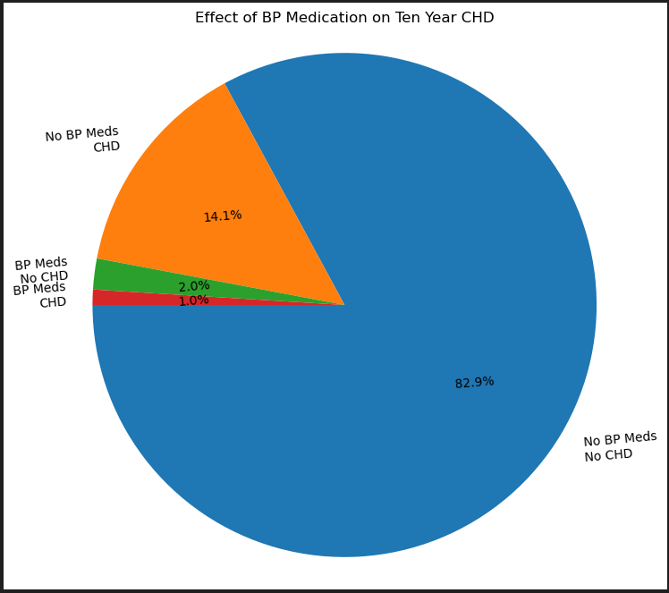
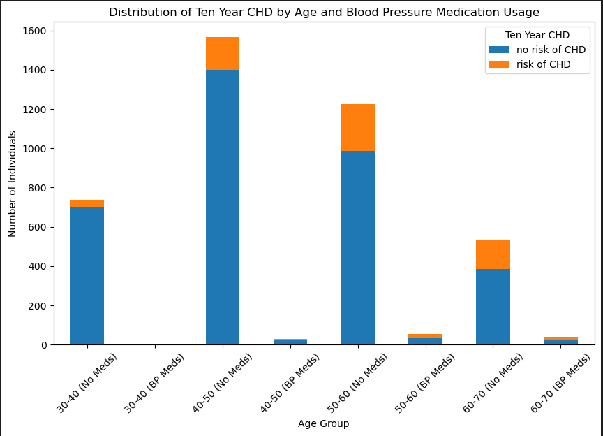

# Framingham Ten Year Coronary Heart Disease Data Analysis

## Project1 - University of Minnesota - Data Visualization and Analytics Bootcamp

### Contributors (Group 5): 
    Atul Shiwakoti
    Ezrelle Myhre-Hager
    Indu Bandi
    Tianyue Li

## Project Overview

The Framingham Heart Study dataset provides various valuable insights into the risk factors associated with coronary heart disease over a ten-year period. This project aims at analyzing key variables and their association in the incidence of Ten Year Coronary Heart Disease (CHD).

## DataSet Overview

The Framingham Heart Disease Analysis dataset contains demographic information and medical history of individuals, including age, gender, cholesterol levels, blood pressure, and smoking status, heartRate, glucose. Key variables used for analysis include age, BPMeds, smoking status, diabetes, BMI, PrevalentStroke, PrevalentHyp and Ten Year CHD.

# DataSet Description
The dataset is in the csv format and consists of the following key variables:

    male: Gender of the individual ( 1 = MALE, 0 = FEMALE )
    age: Age of the individual in years
    currentSmoker: Indicates the Smoking Status (1 = Yes, 0 = No)
    BPMeds: Indicates the usage of Blood Pressure Medications (1 = yes, 0 = No)
    Diabetes: Indicates whether the individual is diabetic or not (1 = Yes, 0 = No)
    Prevalent Stroke: Indicates the Stroke status (1 = Yes, 0 = No)
    Prevalent Hyp: Indicates the Hypotention status (1 = Yes, 0 = No)
    TenYearCHD: Indicates whether the individual developed CHD within ten years (0 = No, 1 = Yes)

## Research Questions
As shown in the dataset, we are trying to look at various factors that can show the effect on the incidence of CHD in a Ten Year Period. Questions we tried to answer here are:

    1. Cigarette impact on Heart Disease
    2. BP Medications impact on Heart Disease
    3. Diabetes Correlation with Heart Disease
    4. Gender classification on Heart Disease
    5. PrevalentStroke, PrevalentHyp impact on heart disease
    6. BMI impact on heart disease

## Repo Structure
    heart-disease-analysis
    |___ Images
    |___ Resources
        |___ framingham.csv
    |___ heart-disease-data-analysis.ipynb
    |___ README.md

## Analysis Findings
1. Approximately 15% of the Framingham Dataset has the incidence of Ten Year CHD (Coronary Heart Disease)
    

### BPMeds - Age - CHD Analysis
1. 3% of individuals reported using the Blood Pressure Medications, among with 1% have the incidence of CHD

2. With a small p-value (e.g., 3.10e-08) in BPMeds and Ten Year CHD, we reject the null hypothesis. Meaning there is significant association between the bpmeds and TenYearCHD variables, and individuals taking bpmeds may have a different risk of developing CHD within ten years compared to those not taking medication.

3. High CHi Square (30.65) shows the a stronger association between the variables (BPMeds and Ten Year CHD)

4. The majority of individuals in this dataset fall within the age range of 30 to 70 years.

5. The distribution of age in the dataset is relatively normal, mean age is approximately 49 years

6. The p-value on a T-test is less than 0.05, it means that there is statistically significant difference between the mean ages of the two populations, and the age distribution of individuals on blood pressure medication differs significantly from those not on medication.

    

## Age - Prevalent Stroke - Prevalent Hyp - TenYearCHD analysis
1. Age is not strongly correlated with CHD
    * Age is negatively correlated with amount of cigarrets per day
    * As age increases, the amount of cigarrets consumed per day stays relatively consistent; Meanwhile the amount of participants having heart disease does not show a siginificant decrease as the amounts of cigarrets per day being decreased.
    * This could indicate a lack of correlation between cigarrets per day and the risk of having heart disease in 10 years.

2. Risk of having chronic heart disease in ten years is positively correlated with the a person having prevalent stroke
    * There is a 0.23 correlation between these two elements
    * When a person stroke is present, there's a higher risk of chronic heart disease for this participant.

3. Stroke & Hyp vs TenYear CHD
    * There's a likelyhood of TenYear CHD increasing as prevalence of Stroke increases. 
    * There is a likelihood of TenYear CHD increasing as prevalence of hypotension increases.

4. Age vs Prevalent Stroke: 
    * As age increases from 31 - 60 years old, the percentage of stroke increases. 
    * While within age group 61 - 70 years old, the percentage of Stroke decreases significantly. 

## Recommendations
1. Continued monitoring of cardiovascular risk factors, especially in older age groups, is essential for early detection and prevention of coronary heart disease.

## Limitations
1. The dataset may not capture all relevant variables contributing to coronary heart disease risk.
2. It's common knowledge that people with diabetes are twice as likely to have heart disease. (Check out [Diabetes and Your Heart](https://www.cdc.gov/diabetes/library/features/diabetes-and-heart.html#:~:text=If%20you%20have%20diabetes%2C%20you,are%20to%20have%20heart%20disease.) for more info.) Since our population for diabetes is so low we would have liked a higher population of diabetics in this data set to have more confidence in our analysis.
3. Due to limited age selected from our data population, the analysis is unable to examine causes for the decrease of Stroke, Hyp within the age range of 61 -70 compared to 51-60.

## Conclusion

This report provides an overview of the analysis conducted on the Framingham Ten Year Coronary Heart Disease dataset, highlighting key findings, conclusions, recommendations, and limitations. Additional analysis and in-depth investigations can further enhance our understanding of cardiovascular risk factors and interventions.

## Sources and References

1. Dataset Source: [Framingham Dataset](https://www.kaggle.com/datasets/aasheesh200/framingham-heart-study-dataset?select=framingham.csv)

2. ContingencyTable and Chi-Square Test:

   a. [Chi-Square-Test-In-Python](https://medium.com/swlh/how-to-run-chi-square-test-in-python-4e9f5d10249d)

    b. [Chi-square-python](https://pythonfordatascienceorg.wordpress.com/chi-square-python/)

